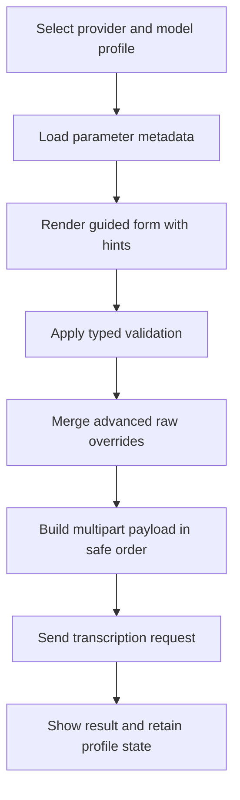

# Parameter Optimization Plan for Multi-Provider ASR Testbed

## Scope and Outcome

Design and implement per-provider, per-model parameter presets with guided hints plus an advanced raw key-value override layer.

Providers in-scope:
- Mistral
- OpenAI
- Cohere API
- ElevenLabs
- Local Server
- Cohere ONNX

Primary goal:
- Make model configuration fast and safe for experimentation while preserving low-friction manual overrides.

---

## Current-State Findings

### What exists already
- Provider-level config model with endpoint/auth/model fields.
- Batch transcription request builder sends model, language, optional temperature, optional context bias, then file.
- Context bias modes already supported:
  - `none`
  - `whisper_prompt` using `prompt`
  - `cohere_terms` using `context_bias_terms`

### Gaps to close
- No per-model parameter profiles, only a few provider-level fields.
- No guided parameter UI with model-specific hints.
- No advanced override editor for arbitrary request keys.
- Provider editor does not persist all provider fields during clone/edit/save (temperature and context-bias-mode are dropped).

---

## Architecture Proposal

## 1. Provider model profile layer

Add strongly-typed profile structures under each provider:

- `TranscriptionProfiles: List<TranscriptionModelProfile>`
- `DefaultTranscriptionProfileId: string`

Each profile stores:
- `Id`, `DisplayName`, `ModelId`
- `ParameterValues` dictionary keyed by normalized parameter names
- `Hints` (read-only metadata, not user-edited)
- `Enabled` flag

### Parameter field type system

Define parameter metadata with:
- `Name`
- `FieldType` (string, number, integer, bool, enum, list-string, json)
- `ApiFieldName` (request key)
- `AppliesTo` provider + model pattern
- `DefaultValue`
- `Validation` rules (min/max, regex, max-items)
- `UiHint` and `DocsHint`
- `Order` for deterministic request assembly

This gives one canonical source for:
- validation,
- rendering controls,
- serialization.

## 2. Request composition pipeline

Refactor composition into stages:

1) Base required fields
2) Profile typed fields
3) Context-bias adapter injection
4) Advanced raw overrides merge
5) File append last

Collision rule:
- Raw overrides win over typed fields, with warning marker shown in UI.

## 3. Advanced raw override layer

Add `RawTranscriptionOverrides: List<KeyValueOverride>` per profile:
- `Key`
- `Value`
- `ValueTypeHint` (string/number/bool/json)
- `Enabled`

Validation:
- Reject duplicate keys after normalization.
- Reject reserved keys that must be controlled by pipeline (`file` and other protected keys).

---

## Config Schema and Migration

## Versioning

Add config schema version in root, e.g. `ConfigSchemaVersion`.

## Backward-compatible migration

On load:
1. If profile list absent, synthesize one profile per provider from legacy fields.
2. Map legacy temperature and context-bias mode into profile parameters.
3. Keep legacy fields during transition period to support rollback.
4. Save in new format while retaining readable defaults.

On save:
- Persist all provider fields and all profile/override data.

---

## UX Design

## Provider settings UI enhancements

Add a model profile editor panel with:
- Profile selector
- Quick presets dropdown per provider
- Parameter form generated from metadata
- Inline hints and recommended ranges
- Advanced overrides grid

Interaction model:
- Basic section: common controls
- Advanced section: raw key-values
- Effective payload preview (read-only) to show exactly what is sent

### Hint strategy

For each parameter, show:
- what it does,
- safe range,
- provider/model applicability,
- known interactions (for example, prompt versus context bias terms).

---

## Provider Research Matrix to Build During Implementation

Track for each provider/model pair:
- accepted multipart keys
- value type and allowed range
- default behavior when omitted
- unsupported keys behavior
- ordering constraints

Initial matrix rows:
- OpenAI: `whisper-1`, `gpt-4o-transcribe`, `gpt-4o-mini-transcribe`
- Mistral: current Voxtral model variants
- Cohere API: current transcribe model identifiers
- ElevenLabs: `scribe_v2` and model field naming behavior
- Local Server: OpenAI-compatible superset behavior
- Cohere ONNX: local-only options and unsupported HTTP parameters

---

## Persistence Fixes Required

Provider editor clone/load/save must include all provider properties, especially:
- temperature
- context bias mode
- model field name
- auth header name
- endpoint override

Avoid silent data loss when switching providers in the settings window.

---

## Validation and Manual Test Plan

Test across:
- Batch dictation request payload correctness
- Realtime behavior isolation from batch-only params
- AI mode unaffected by transcription profile changes
- Post-process flow unchanged unless intentionally configured

Payload validation checks:
- field presence and order
- type correctness
- profile + override merge correctness
- context-bias mapping correctness by mode

---

## File-by-File Change Map

- `AppConfig.cs`
  - add profile and override models
  - add migration helpers
  - add default preset seeding

- `ProviderSettingsWindow.xaml`
  - add model profile UI
  - add hints and advanced override grid
  - add effective payload preview area

- `ProviderSettingsWindow.xaml.cs`
  - load/save/clone new fields
  - metadata-driven form binding
  - validation and duplicate-key protection

- `MainWindow.xaml.cs`
  - compose payload via staged builder
  - merge typed params + overrides
  - preserve provider-specific ordering rules

- `README.md`
  - document profile system
  - document advanced override behavior

---

## Mermaid Overview

